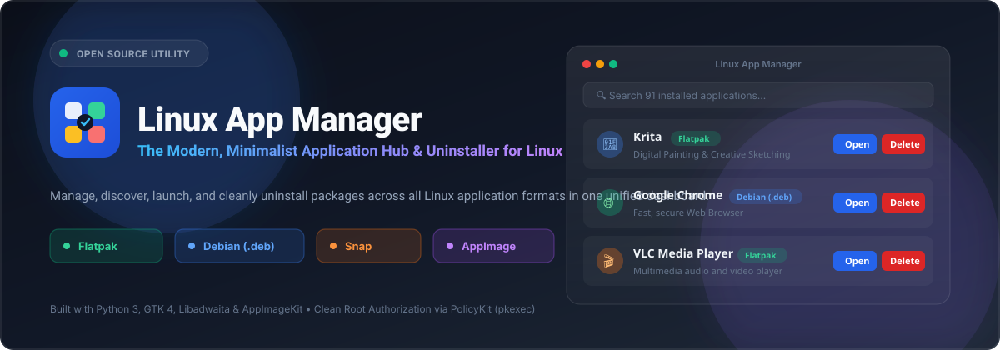
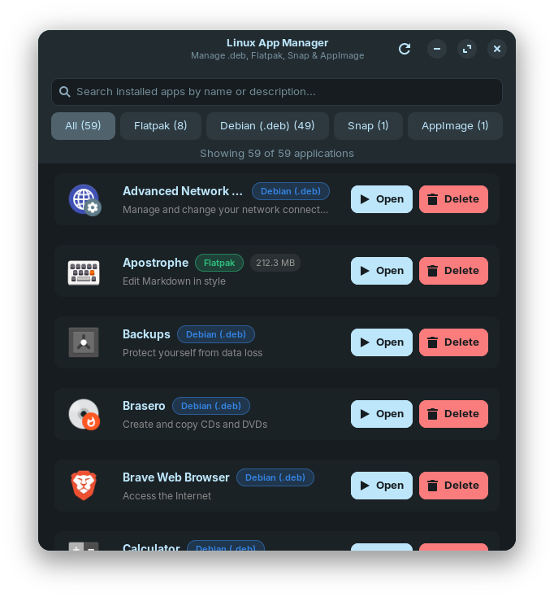
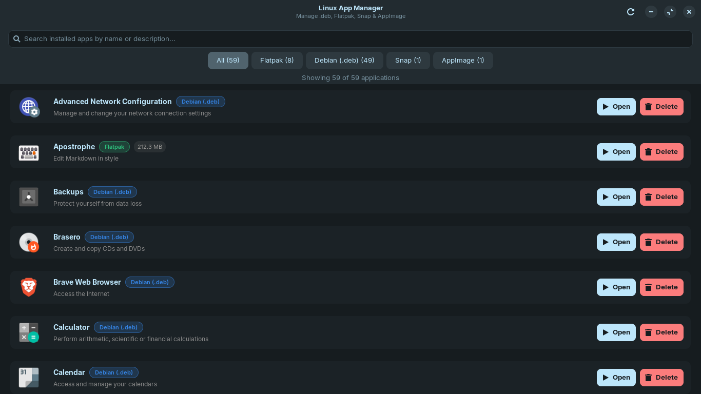

<p align="center">
  
</p>

<p align="center">
  <a href="https://github.com/Shivant7857/linux-app-manager/releases/latest"></a>
  <a href="https://github.com/Shivant7857/linux-app-manager/releases"></a>
  <a href="https://github.com/Shivant7857/linux-app-manager"></a>
  <a href="https://python.org"></a>
  <a href="https://gnome.pages.gitlab.gnome.org/libadwaita/"></a>
  <a href="LICENSE"></a>
</p>

<p align="center">
  <b>A modern, lightning-fast, and minimalist universal application hub and uninstaller for Linux.</b><br>
  Manage, launch, and cleanly uninstall packages across all packaging systems (<b>Flatpak</b>, <b>Debian .deb / APT</b>, <b>Snap</b>, and <b>AppImage</b>) from a single unified interface.
</p>

<p align="center">
  <a href="https://github.com/Shivant7857/linux-app-manager/releases/download/v1.0.0/LinuxAppManager-x86_64.AppImage">
    
  </a>
</p>

---

## 📑 Table of Contents

- [📸 Screenshots](#-screenshots)
- [🌟 Key Features](#-key-features)
- [📊 Package Support Matrix](#-package-support-matrix)
- [📥 Quick Installation & Download](#-installation--usage)
- [🔨 Building From Source & AppImage Packaging](#-building-the-appimage)
- [🗂️ Project Directory Structure](#️-project-structure)
- [🛣️ Future Roadmap](#️-roadmap)
- [🤝 Contributing & Community](#-contributing)
- [📄 Open Source License](#-license)

## 📸 Screenshots

<p align="center">
  
</p>

<p align="center">
  <em>Modern, native Libadwaita dark interface running on Linux with real-time app counts, status badges, and quick actions.</em>
</p>

<details>
  <summary><b>🔍 Click here to view Fullscreen / Wide View</b></summary>
  <br>
  <p align="center">
    
  </p>
</details>

---

## 🌟 Key Features

- 📦 **Universal Package Management & Discovery**:
  - 🟢 **Flatpak**: Reads application IDs, installed size, versions, and metadata from system & user remotes.
  - 🟠 **Debian (`.deb` / APT)**: Scans system desktop files and batch resolves package ownership using `dpkg -S`.
  - 🟣 **Snap**: Detects user-installed snaps, track revisions, and package information.
  - 🔵 **Standalone AppImage**: Automatically scans `~/Applications`, `~/Downloads`, `/opt`, `~/.local/bin`, and `~` for `.AppImage` files.
- 📥 **One-Click Package Installer (NEW in v1.1.0)**:
  - **In-App Install**: Use the header **`+ Install File`** button to browse and install `.deb`, `.flatpak`, `.flatpakref`, or `.AppImage` files.
  - **"Open With..." Desktop Integration**: Right-click any `.deb`, `.flatpak`, or `.AppImage` in your Linux file manager and choose **Open with Linux App Manager** to inspect and install with one click!
  - **Smart Dependency Resolution**: Installs `.deb` packages via APT to automatically pull missing dependencies.
  - **Automated AppImage Desktop Integration**: Moves AppImages to `~/Applications/`, marks executable, and generates a `.desktop` entry in your Application Menu.
- ⚡ **Ultra Fast Discovery**: Sub-second full system indexing (< 0.75s) using optimized batch queries and asynchronous threading.
- 🎨 **Minimal & Modern UI**: Built with **GTK 4** and **Libadwaita**, respecting your system's dark/light theme, typography, and GNOME/Zorin OS aesthetics.
- 🔍 **Real-Time Search & Category Filters**: Filter apps instantly by package type (`All`, `Flatpak`, `Debian (.deb)`, `Snap`, `AppImage`) or keyword.
- ▶️ **One-Click App Launcher**: Launch any installed application detached in the background with a single click.
- 🗑️ **Clean Uninstaller**:
  - Non-destructive confirmation dialogs before any package removal.
  - Integrates with native **PolicyKit (`pkexec`)** for secure graphical root authorization prompts when removing system packages.
  - Asynchronous background removal without freezing the user interface.
- 🛡️ **System Protection Safeguard**:
  - Core system packages (e.g., `nautilus`, `zorin-desktop`, `gnome-shell`, `settings`, `systemd`) are automatically locked and protected from deletion to prevent accidental OS breakage.
- 🚀 **Zero-Dependency Portable AppImage**:
  - Single standalone `.AppImage` executable with an integrated Type 2 ELF runner—no installation or runtime setup required.

---

## 📊 Package Support Matrix

| Format | Discovery Mechanism | Installation Backend | Uninstallation Backend | Root Privileges? |
|---|---|---|---|---|
| **Debian (.deb)** | `Gio.AppInfo` + `dpkg -S` | `pkexec apt install -y <deb>` | `pkexec apt remove -y <pkg>` | 🔑 Yes (via Polkit prompt) |
| **Flatpak** | `flatpak list --app` | `flatpak install -y <file>` | `flatpak uninstall -y <app-id>` | ❌ No (User) / 🔑 System |
| **AppImage** | System directory crawler | Installs to `~/Applications` + creates `.desktop` menu launcher | Safe file deletion + removes `.desktop` | ❌ No |
| **Snap** | `snap list` | Pre-installed / Snapcraft | `pkexec snap remove <pkg>` | 🔑 Yes (via Polkit prompt) |

---

## 📥 Installation & Usage

### Method 1: Download Pre-Built AppImage (Recommended)

1. Clone or download `LinuxAppManager-x86_64.AppImage`:
   ```bash
   git clone https://github.com/Shivant7857/linux-app-manager.git
   cd linux-app-manager
   ```

2. Make it executable and run:
   ```bash
   chmod +x LinuxAppManager-x86_64.AppImage
   ./LinuxAppManager-x86_64.AppImage
   ```

3. *(Optional)* Add to your user applications menu:
   ```bash
   mkdir -p ~/Applications ~/.local/share/applications ~/.local/share/icons/hicolor/scalable/apps
   cp LinuxAppManager-x86_64.AppImage ~/Applications/
   cp linux-app-manager.svg ~/.local/share/icons/hicolor/scalable/apps/
   cp linux-app-manager.desktop ~/.local/share/applications/
   update-desktop-database ~/.local/share/applications/
   ```

---

### Method 2: Run From Source

#### Prerequisites
Install the required GTK 4 and Libadwaita development packages on your Linux distribution:

- **Ubuntu / Debian / Zorin OS / Linux Mint**:
  ```bash
  sudo apt update
  sudo apt install -y python3 python3-gi gir1.2-gtk-4.0 gir1.2-adw-1 squashfs-tools gcc
  ```

- **Fedora**:
  ```bash
  sudo dnf install -y python3 python3-gobject gtk4 libadwaita squashfs-tools gcc
  ```

- **Arch Linux**:
  ```bash
  sudo pacman -S python python-gobject gtk4 libadwaita squashfs-tools gcc
  ```

#### Launch Application
```bash
python3 app.py
```

---

## 🔨 Building the AppImage

You can rebuild the standalone `.AppImage` at any time with a single command:

```bash
chmod +x build_appdir.sh package_appimage.sh
./package_appimage.sh
```

This will:
1. Construct the `AppDir` directory layout with icons and desktop metadata.
2. Compile `runtime.c` into a Type 2 ELF AppImage runner.
3. Compress the payload with **SquashFS** (`xz` compression).
4. Combine the runtime and payload into `LinuxAppManager-x86_64.AppImage`.

### CLI Options for AppImage:
```bash
./LinuxAppManager-x86_64.AppImage --appimage-version
./LinuxAppManager-x86_64.AppImage --appimage-extract
./LinuxAppManager-x86_64.AppImage --appimage-help
```

---

## 🗂️ Project Structure

```
linux-app-manager/
├── app.py                      # Main GTK 4 + Libadwaita user interface
├── scanner.py                  # Multi-format package scanner & manager engine
├── runtime.c                   # Lightweight C ELF runtime for Type 2 AppImage
├── build_appdir.sh             # AppDir layout builder script
├── package_appimage.sh         # AppImage assembler and SquashFS compressor
├── linux-app-manager.desktop   # Desktop application entry
├── linux-app-manager.svg       # Official vector application icon
├── LinuxAppManager-x86_64.AppImage # Ready-to-run standalone executable
├── assets/                     # Graphic assets, banners, and screenshots
│   ├── banner.svg
│   ├── logo.svg
│   ├── preview.png
│   └── screenshot.png
├── .github/workflows/          # Automated GitHub Actions CI pipeline
│   └── build-appimage.yml
├── LICENSE                     # MIT Open Source License
└── README.md                   # Project documentation
```

---

## 🛣️ Roadmap

- [x] Multi-format package detection (.deb, Flatpak, Snap, AppImage)
- [x] One-click Open & Delete actions with Polkit root authorization
- [x] Core OS component safety locks
- [x] Standalone portable `.AppImage` compilation
- [ ] Direct package update checker (`flatpak update`, `apt update`)
- [ ] Disk space reclaimed estimator
- [ ] Export installed applications list (JSON / CSV backup)

---

## 🤝 Contributing

Contributions, bug reports, and feature requests are welcome!  
Feel free to open an **[Issue](https://github.com/Shivant7857/linux-app-manager/issues)** or submit a **[Pull Request](https://github.com/Shivant7857/linux-app-manager/pulls)**.

1. Fork the Project
2. Create your Feature Branch (`git checkout -b feature/AmazingFeature`)
3. Commit your Changes (`git commit -m 'Add some AmazingFeature'`)
4. Push to the Branch (`git push origin feature/AmazingFeature`)
5. Open a Pull Request

---

## 📄 License

Distributed under the **MIT License**. See [`LICENSE`](LICENSE) for more information.

---

<p align="center">
  Made with ❤️ by <a href="https://github.com/Shivant7857"><b>Shivant</b></a>
</p>